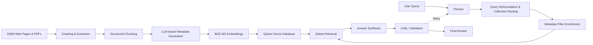

# DIEM Agentic RAG Assistant

A source-grounded **Retrieval-Augmented Generation (RAG)** assistant designed to answer questions about the **DIEM Department at the University of Salerno**.

The project combines an automated knowledge-base construction pipeline with a **LangGraph-based agentic workflow** for query understanding, metadata-aware retrieval, answer generation, and response validation.

This project was developed as part of the **LLM & NLP course** of the M.Sc. in Computer Engineering – Artificial Intelligence & Robotics at the University of Salerno.

---

## Overview

The system is composed of two main components:

1. **Knowledge Base & Vector Database Pipeline**
   - Crawls DIEM web pages and linked documents.
   - Extracts structured content from HTML and PDF sources.
   - Applies content-aware chunking.
   - Generates domain-specific metadata and example questions for each chunk using an LLM.
   - Creates dense embeddings with **BAAI/bge-m3**.
   - Stores documents in multiple **Qdrant** collections.
   - Supports incremental indexing and knowledge-base updates.

2. **Agentic RAG Chatbot**
   - Classifies the user intent.
   - Reformulates and decomposes complex queries.
   - Routes each query to the appropriate knowledge collection.
   - Extracts metadata filters from the user request.
   - Performs semantic retrieval over Qdrant.
   - Generates source-grounded answers.
   - Uses a critic stage to validate the generated response and retry when necessary.
   - Provides a conversational **Gradio** interface.

---

## Architecture



---

## Knowledge Base Pipeline

The first notebook implements the complete pipeline used to create the knowledge base.

### Data Acquisition

The crawler explores selected sections of the DIEM website and processes both:

- HTML pages
- linked PDF documents

The extracted content is stored together with information such as the original source URL, document type, content hash, crawling depth, and extraction timestamp.

### Structured Content Extraction

HTML and PDF content is converted into a structured representation in order to preserve useful information such as:

- headings;
- paragraphs;
- lists;
- tables.

Different chunking strategies are applied depending on the type and size of the content.

### LLM-based Metadata Generation

A local **Qwen3 14B** model served through **Ollama** is used to extract metadata associated with each chunk.

The metadata schema is adapted to the specific content domain. Depending on the source, extracted information can include:

- keywords;
- example questions;
- dates and deadlines;
- academic year;
- people and roles;
- courses and curricula;
- research areas;
- target audience;
- partner universities;
- document type and status.

The generated example questions are also used to improve semantic retrieval.

### Vector Database

Embeddings are generated using:

**BAAI/bge-m3**

and stored in **Qdrant**.

Each document can contain multiple vector representations:

- the embedding of the original content;
- an embedding of a first generated question;
- an embedding of a second generated question.

This allows retrieval to exploit both the original document representation and possible natural-language questions associated with the content.

The knowledge base is divided into multiple collections according to the information domain.

### Incremental Updates

The indexing pipeline uses **LangChain SQLRecordManager** to identify previously processed documents and update only modified content.

This enables incremental synchronization of the knowledge base instead of rebuilding the entire vector database whenever the source content changes.

---

## Agentic RAG Workflow

The chatbot is implemented as a **LangGraph StateGraph** following a Plan-and-Execute architecture.

The main workflow is:

```text
Planner
   ↓
Filter Enricher
   ↓
Executor
   ↓
Synthesizer
   ↓
Critic
   ↓
Final Answer
```

If the Critic considers the answer unsatisfactory, feedback is returned to the Planner and the pipeline can execute a new retrieval attempt.

### Planner

The Planner performs three main tasks:

1. **Intent Classification**
2. **Query Reformulation / Decomposition**
3. **Knowledge Collection Selection**

Complex questions can therefore be decomposed into multiple atomic queries and routed independently.

The system also distinguishes between:

- DIEM-related questions;
- requests requiring clarification;
- general conversation;
- out-of-domain requests;
- inappropriate requests;
- graduation-grade calculator requests.

### Metadata Filter Enrichment

Before retrieval, the system analyzes the query and extracts useful structured constraints.

These filters are matched against the metadata available for the selected knowledge collection and converted into Qdrant filtering conditions.

This allows semantic retrieval to be combined with structured constraints such as:

- year;
- academic year;
- course;
- professor;
- curriculum;
- country;
- partner university;
- status;
- document type;
- research area.

### Retrieval

The Executor queries the appropriate Qdrant collection using **BGE-M3 embeddings**.

Retrieval can search across the document vector and the additional question-based vectors generated during knowledge-base construction.

The retrieved documents are then ranked and passed to the answer-generation stage.

### Answer Synthesis

The Synthesizer generates the final response using the retrieved institutional information.

The assistant is instructed to remain grounded in the retrieved sources and preserve important structured information such as:

- contacts;
- deadlines;
- courses;
- study plans;
- calls and announcements;
- requirements;
- links to official sources.

### Critic and Retry

A dedicated LLM-based Critic evaluates whether the generated answer adequately addresses the user request.

When the response is considered insufficient, the Critic provides feedback and triggers a new planning and retrieval cycle.

This introduces a controlled self-correction mechanism into the RAG workflow.

### Conversation Memory

LangGraph's **MemorySaver** is used to preserve conversational context across turns, allowing the system to handle follow-up questions and references to previous messages.

---

## Knowledge Collections

The knowledge base is organized into dedicated Qdrant collections covering different DIEM information domains, including:

- **Faculty and Contacts**
- **International Mobility**
- **Educational Offer**
- **Calls and Announcements**
- **Research, Events and Department Initiatives**
- **Institutional Information and Facilities**

The Planner dynamically selects the appropriate collection according to the user's request.

---

## User Interface

The project includes a custom **Gradio** interface providing:

- conversational interaction with the assistant;
- conversation history;
- chat reset controls;
- access to a graduation-grade calculator;
- presentation of official links and retrieved information.

---

## Repository Structure

```text
DIEM-Agentic-RAG-Assistant/
│
├── 01_vector_database.ipynb
├── 02_rag_chatbot.ipynb
└── README.md
```

### `01_vector_database.ipynb`

Implements the knowledge-base construction and indexing pipeline:

- website crawling;
- HTML and PDF extraction;
- structured content conversion;
- chunking;
- LLM-based metadata generation;
- question generation;
- BGE-M3 embedding generation;
- Qdrant population;
- incremental knowledge-base updates.

### `02_rag_chatbot.ipynb`

Implements the conversational RAG system:

- intent classification;
- query reformulation and decomposition;
- knowledge-collection routing;
- metadata filter extraction;
- semantic retrieval;
- answer synthesis;
- critic-based validation and retry;
- conversational memory;
- Gradio user interface.

---

## Tech Stack

### LLM & Agentic RAG

- LangChain
- LangGraph
- LangSmith
- Ollama
- Qwen3 14B

### Retrieval & Embeddings

- Qdrant
- BAAI/bge-m3
- Hugging Face Embeddings

### Data Processing

- BeautifulSoup
- spaCy
- Marker PDF
- PyPDF
- Requests

### Interface

- Gradio

### Language

- Python

---

## Running the Project

The repository contains the source notebooks developed for the academic project.

The original implementation relies on environment-specific resources, including local or Google Drive paths, generated metadata manifests, crawled data, and a persistent Qdrant database.

For this reason, the notebooks are primarily provided as **project source code and technical documentation** and are not intended to run out of the box without adapting the environment-specific configuration.

The logical execution order is:

```text
01_vector_database.ipynb
        ↓
02_rag_chatbot.ipynb
```

The first notebook constructs and indexes the knowledge base, while the second notebook uses the resulting Qdrant database and metadata manifests to run the conversational assistant.

---

## Project Goals

The project explores how a conventional RAG pipeline can be extended with:

- automated knowledge acquisition;
- domain-specific metadata;
- query decomposition;
- dynamic retrieval routing;
- structured filtering;
- multiple vector representations;
- response validation;
- iterative retrieval and self-correction.

The goal is to provide reliable access to heterogeneous institutional information while keeping generated answers grounded in authoritative source material.

---

## Author

**Alex Cuciniello**

M.Sc. Computer Engineering – Artificial Intelligence & Robotics  
University of Salerno

- [GitHub](https://github.com/Alex-Cuciniello)
- [LinkedIn](https://www.linkedin.com/in/alex-cuciniello/)
